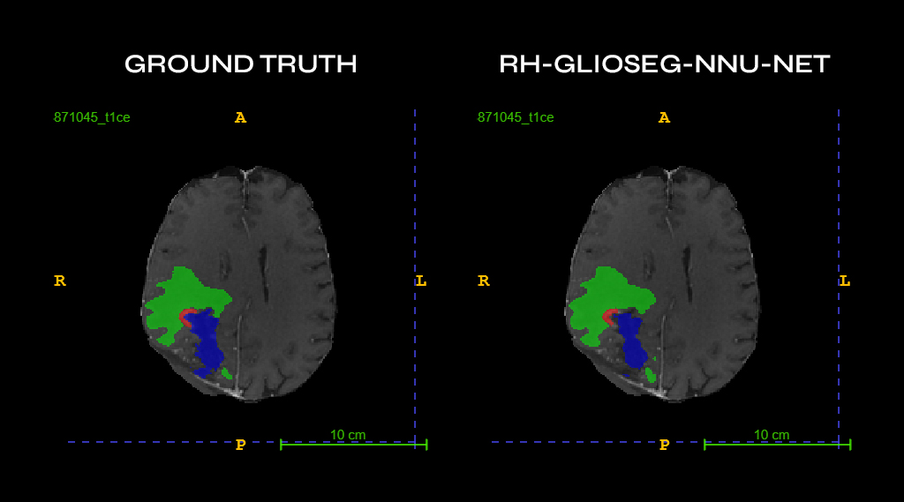

# Postoperative glioblastoma segmentation. Development of a fully automated pipeline and comparison with currently available models
This repository contains the Python implementation of the paper: 
>Cepeda S, Romero-Oraá R, García-Pérez D, Blasco G, Luppino LT, Kuttner S, Arrese I, Solheim O, Eikenes L, Karlberg A, Pérez-Núñez A, Escudero T, Hornero R, Sarabia R.
Postoperative glioblastoma segmentation. Development of a fully automated pipeline and comparison with currently available models.



This work presents a **fully automated pipeline** that incorporates the processing of multiparametric magnetic resonance imaging (MRI) and the automatic segmentation of **tumor subregions in postoperative scans**. It includes the following stages:
- DICOM to NifTI conversion
- ADC computation
- Image registration
- Skull stripping
- Intensity normalization
- Tumor segmentation

## Installation
All required packages can be installed using the following command:
```bash
pip install -r requirements.txt
```
> [!NOTE]
> You should install PyTorch as described on their [website]([conda/pip](https://pytorch.org/get-started/locally/)) based on your system settings (OS, CUDA version, etc.)

Due to Git file size limitations, the segmentation model must be downloaded from this [link](https://drive.google.com/file/d/17b6sKdyErUhhtcBRD2-oFOk-ORbGvDo1/view) and extrated into the root path (the folder *my_nnunet* must be placed next to the file *main.py*).

## Data preparation
The pipeline accepts DICOM images (*.DCM) grouped as follows:
```
INPUT_FOLDER
├── Subject_1
│   ├── TimePoint_1
│   │   ├── dwi
│   │   │   ├── *.DCM
│   │   │   ├── *.DCM
│   │   │   ├── ...
│   │   ├── flair
│   │   │   ├── ...
│   │   ├── t1
│   │   │   ├── ...
│   │   ├── t1ce
│   │   │   ├── ...
│   │   ├── t2
│   │   │   ├── ...
│   ├── TimePoint_2
│   ├── TimePoint_3
├── Subject_2
│   ├── ...
├── Subject_3
│   ├── ...
```
The input folder must contain a folder per subject (which should be named with a number). Each subject folder must contain a folder per time point (which should be named with a number). Each time point folder must contain 5 folders: *dwi*, *flair*, *t1*, *t1ce* and *t2*. Each of those must contain a set of DICOM files.

Also, you have to create an empty folder to output the results of the pipeline.

## Usage
### GUI
The pipeline comes with a grafical user interface (GUI) to easily run the pipeline.
### Command line
```bash
python.exe main.py -i INPUT_FOLDER -o OUTPUT_FOLDER
```

## License